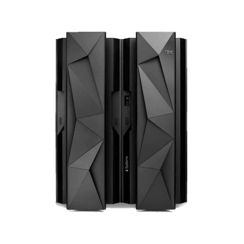

# About Mainframe

A mainframe computer, informally called a mainframe or big iron, is a computer used primarily by large organizations for critical applications like bulk data processing for tasks such as censuses, industry and consumer statistics, enterprise resource planning, and large-scale transaction processing. A mainframe computer is large but not as large as a supercomputer and has more processing power than some other classes of computers, such as minicomputers, servers, workstations, and personal computers. Most large-scale computer-system architectures were established in the 1960s, but they continue to evolve. Mainframe computers are often used as servers.

The term mainframe was derived from the large cabinet, called a main frame, that housed the central processing unit and main memory of early computers. Later, the term mainframe was used to distinguish high-end commercial computers from less powerful machines.

Here is what a mainframe looks like:

